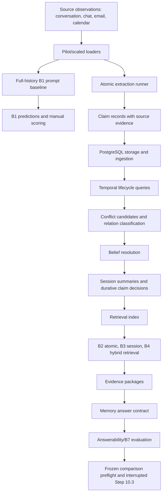

# Implementation audit

## 1. Executive snapshot

This repository is an evaluation-first longitudinal memory project. It has more than a README-level prototype: it contains frozen benchmark data, schema validators, a full-history B1 pilot baseline, extraction runs, PostgreSQL storage and lifecycle code, deterministic conflict and retrieval pipelines, evidence package construction, answerability mechanics, and a partially attempted frozen B0-B7 comparison.

The strongest verified claim is narrow: the project can expose longitudinal memory failures with evidence-backed scoring. The clearest evidence is the B1 pilot run: 25 QA cases, 23 strict correct answers, 24 lenient correct answers, zero execution failures, 12 reviewed reasoning failures, and one unsupported date claim in `results/pilot/b1-full-history/`.

The project is not founder-ready as a one-command external demo. There is no README, no `.env.example`, no UI, no hosted deployment, and the full local suite currently fails six hash/topology tests because the worktree contains uncommitted Step 10.3 changes. The deterministic validators and one Docker-backed retrieval gate did pass during this audit.

## 2. Repository architecture

The repository is organized around an evaluation pipeline rather than a product app.

| Area | Evidence | Status |
| --- | --- | --- |
| Project contracts | `docs/benchmark.md`, `docs/memory-ontology.md`, `docs/memory-evaluation-steps.md`, `docs/Implementation-handoff.md` | Working and verified by inspection |
| Pilot dataset | `data/pilot/`, `schemas/*.schema.json` | Working and verified by `evaluation.smoke --dry-run` |
| Benchmark v1 and scaled data | `data/benchmark-v1/`, `data/scaled-v1/`, `schemas/scaled-v1/` | Working and verified by validators |
| B1 full-history baseline | `src/evaluation/b1_full_history.py`, `results/pilot/b1-full-history/` | Working and verified from committed results |
| Atomic extraction | `src/extraction/`, `results/phase3/` | Implemented; dry-run verified; paid run results inspected |
| PostgreSQL storage and ingestion | `src/storage/`, `src/ingestion/`, `migrations/0001` through `0003` | Implemented; live coverage indirectly verified through retrieval gate |
| Temporal lifecycle and evaluation | `src/temporal/`, `src/evaluation/temporal.py`, `results/phase4/` | Implemented but only development-set verified |
| Conflict detection and resolution | `src/conflicts/`, `results/conflicts/` | Partially implemented; development examples are small |
| Summaries and durative claims | `src/summaries/`, `results/summaries/` | Partially implemented; structural checks, not product-quality summaries |
| Retrieval | `src/retrieval/`, `results/retrieval/` | Working and runtime-verified for B2-B4 on development data |
| Grounded answering | `src/answering/`, `results/answering/` | Partially implemented; current memory answer run abstains structurally |
| Abstention | `src/abstention/`, `results/abstention/` | Partially implemented; B7 development run has 0 coverage |
| UI/deployment | no frontend, no package manifest, no deployment config | Missing |

## 3. Implemented pipeline diagram



Current breakpoints:

- B1 produces scored answers from full source history.
- B2-B4 retrieve evidence but downstream answer generation currently blocks because all packages are candidate-only.
- B5/B6 are not available in the memory-answer quality scorecard.
- B7 exists as a gate comparison on four development cases, but it changes no output and answers no cases.
- UI and deployment do not exist.

## 4. Representative query trace

Representative query: `temporal_003`, "What is the corrected date for Aryan's job start in Bengaluru?"

| Stage | Current trace |
| --- | --- |
| Source event | `data/pilot/sources/conversations.jsonl` contains an older report that Aryan starts on May 11 and a later correction from Aryan. |
| Ingestion | Pilot B1 does not use persisted ingestion. Later storage ingestion exists in `src/ingestion/service.py`, but B1 reads JSONL history directly. |
| Memory representation | Phase 3 extraction stores atomic claims in `results/phase3/phase4-input-development-gpt41-fallback-v1/claims.jsonl`; pilot B1 answers directly from source text. |
| Storage/index | PostgreSQL storage, lifecycle, conflict, summary, and retrieval indexes exist for the scaled development path, not for this B1 pilot question. |
| Retrieval | B1 uses full history, so no retrieval ranking is involved. B2-B4 retrieval exists separately for development queries in `results/retrieval/retrieval-quality-development-v1/`. |
| Answer generation | B1 answered "May 18, 2026" in `results/pilot/b1-full-history/manual_review.jsonl`. |
| Evaluation | `results/pilot/b1-full-history/failure_analysis.jsonl` marks the answer correct but flags missed evidence because the answer cited the correction and omitted the earlier May 11 context. |
| Report/interface | Reports are JSON/JSONL/Markdown files under `results/`. No UI exists. |

## 5. Commands executed

| Command | Result | Notes |
| --- | --- | --- |
| `make validate-scaled-benchmark PYTHON=.venv-storage/bin/python` | Passed | 10 users, 100 sources, 500 QA, 50 summaries, 20 interactive cases, dataset SHA-256 `746756cb...`. |
| `make validate-benchmark-v1 PYTHON=.venv-storage/bin/python` | Passed | 50 QA, 5 summaries, 2 interactive scenarios, 30 gold claims. |
| `make validate-load-corpus PYTHON=.venv-storage/bin/python` | Passed | 2,000 users and 500,000 source events declared in load corpus. |
| `make test PYTHON=.venv-storage/bin/python` | Failed | 1,093 tests ran, 6 failures, 160 skips. Failures were allowlist/hash topology tests affected by current uncommitted drift. |
| `make test-retrieval-baselines PYTHON=.venv-storage/bin/python` | Passed after Docker permission | 132 tests passed against disposable PostgreSQL and cleaned up Docker resources. Retrieval development summary used 8 queries, 24 results, 0 runtime failures, and 63 quality rows. |
| `make analyze-atomic-v2 PYTHON=.venv-storage/bin/python` | Failed safely | Refused to overwrite non-empty `results/phase3/atomic-extraction-v2-failure-analysis-v1`. |
| `make dry-run-atomic-safety PYTHON=.venv-storage/bin/python` | Passed | Made zero provider calls; printed cost and source-transmission plan for 10 pilot extraction requests. |
| `PYTHONDONTWRITEBYTECODE=1 PYTHONPATH=src .venv-storage/bin/python -m evaluation.smoke --dry-run` | Passed | Built five smoke prompts; each used 72 observations and made no model call. |

Memory-answer quality development metrics show 24 abstentions, 0 citations, 0 factual predictions, and 0 non-null metrics in `results/answering/memory-answer-quality-development-v1/checks.json`.

B6 and B7 development evaluation metrics are identical on this checkout: coverage 0/4, abstention precision 0.250000, abstention recall 1.0, unnecessary abstention rate 1.0, and false answer rate 0.0.

The full test failure should not be hidden. The failing tests are:

- `integration.test_answer_quality_evaluation.AnswerQualityIntegrationTests.test_predecessor_hashes_and_tracked_diff_are_exact`
- `integration.test_answerability.AnswerabilityIntegrationTests.test_exact_allowlist_and_protected_hashes`
- `integration.test_b6_b7_comparison_prerequisite.B6B7ComparisonPrerequisiteStaticIntegrationTests.test_committed_prerequisite_and_live_evaluation_topology_are_exact`
- `integration.test_comparison_freeze.ComparisonFreezeIntegrationTests.test_protected_hashes_and_exact_live_additions`
- `integration.test_interactive_answering_v2.InteractiveInputV2IntegrationTests.test_committed_prerequisite_and_live_evaluation_topology_are_exact`
- `integration.test_memory_answer.MemoryAnswerIntegrationTests.test_predecessor_bytes_and_allowlist_are_exact`

These failures compare the current dirty worktree against earlier authorized-drift lists. They do not prove the retrieval or storage code is broken, but they do block a clean founder demo.

## 6. Seven audit questions

### 6.1 What has been built and works so far?

| Component | Status | Evidence | Limitation |
| --- | --- | --- | --- |
| Data generation and fixtures | Working and verified | `data/pilot/`, `data/benchmark-v1/`, `data/scaled-v1/`; validators passed | Synthetic data only; no real audio/transcript ingestion |
| Ingestion | Implemented but not fully runtime-verified in this audit | `src/ingestion/service.py`, `migrations/0002_ingestion_reprocessing.sql`; covered indirectly by retrieval live gate | The broad ingestion Docker target was not separately run in this audit |
| Memory extraction | Partially implemented | `src/extraction/`, `results/phase3/`; dry-run safety passed | Current scaled development extraction has F1 `0.307692`, unsupported-memory rate `0.454545`, valid-time accuracy `0.0` |
| Temporal representation | Working and verified on development cases | `results/phase4/step4.4-temporal-evaluation-v1/scores.json` has 12 predictions and no failures | Mean interval IoU is `0.027027`; cases are small and development-only |
| Retrieval | Working and verified | `make test-retrieval-baselines` passed 132 tests; `results/retrieval/retrieval-quality-development-v1/scorecard.json` scores B2-B4 | B5/B6 are not represented in memory-answer quality |
| Answer generation | Partially implemented | B1 answer baseline works; `src/answering/memory_answer.py` exists | Memory-answer release produces structural abstentions, no answered memory cases |
| Evaluation | Working and verified | B1, extraction, temporal, conflict, retrieval, answering and abstention scorecards exist | Not all evaluations are clean-room or full-scale |
| Reporting/interface | Partially implemented | Markdown and JSON result reports under `results/` | No interactive UI |
| Testing | Partially passing | Validators and retrieval gate pass | Full suite fails six drift-sensitive tests |
| Deployment | Missing | No `README`, `package.json`, `Dockerfile`, hosted config, or UI directory | Not externally runnable as a product demo |

### 6.2 Which longitudinal-memory failures can the project expose?

Supported by actual cases or evaluators:

| Failure category | Evidence | Example |
| --- | --- | --- |
| Missed evidence/provenance | B1 failure analysis: 12 cases | `temporal_003` answers May 18 correctly but omits the older May 11 report and prompt message. |
| Wrong date | B1 failure analysis: 1 contributing case | `user_modeling_001` says Maya started as Marketing Associate in April; the cited offer says May 4, 2026. |
| Explicit correction handling | Pilot gold and B1 review | `conflict_001` expects May 11 to be superseded by May 18 because Aryan directly corrected it. |
| Unsupported user inference | Test taxonomy exists | `tests/unit/test_failure_analysis.py` covers classification, but B1 summary has zero such observed cases. |
| Stale or temporally invalid retrieval | Retrieval scorer measures stale-memory rate | B2 overall stale-memory rate `0.014085`; B4 `0.027778`. |
| Failure to abstain | Pilot gold includes abstention cases and B1 abstention metrics | B1 scored abstention precision and recall `1.0`; current memory B7 over-abstains. |
| Unnecessary abstention | B7 development evaluation | B6 and B7 each have unnecessary abstention rate `3/3`, coverage `0/4`. |
| Wrong speaker/user isolation | Storage/retrieval/conflict tests cover user and speaker boundaries | No current B1 failure in this category, but the implemented tests guard it. |

Not currently demonstrated as real failures in committed runs:

- irrelevant proactive suggestions;
- production-scale contradiction resolution failures;
- a direct B7 improvement over B6;
- unsupported causal explanation failures in final answer generation.

### 6.3 How does the project represent the expected answer?

Pilot expected answers live in `data/pilot/evaluation/eval_answer.jsonl`, joined to `data/pilot/evaluation/eval_questions.jsonl` by `case_id`. Benchmark v1 and scaled data use separate runtime and gold files under `data/benchmark-v1/` and `data/scaled-v1/`.

Simplified current pilot answer shape:

```json
{
  "case_id": "temporal_003",
  "answer_status": "answered",
  "reference_answer": "May 18, 2026.",
  "acceptable_answers": ["May 18", "18 May 2026", "2026-05-18"],
  "should_abstain": false,
  "abstention_reason": null,
  "evidence": [
    {
      "source_id": "conv_003",
      "message_ids": ["msg_conv_003_004"],
      "quotes": ["Aryan is joining his Bengaluru job tomorrow, on the 11th"]
    },
    {
      "source_id": "conv_004",
      "message_ids": ["msg_conv_004_001", "msg_conv_004_002"],
      "quotes": ["Ankita said you started here on May 11", "I actually joined on the 18th, not the 11th"]
    }
  ],
  "oracle_fact_ids": ["fact_019"],
  "notes": "Aryan directly corrects the date reported by Ankita."
}
```

The expected answer is primarily an answer text plus acceptable paraphrases and required evidence. Current versus historical truth is represented through question `as_of`, evidence quotes, oracle fact IDs, and notes. More structured valid time and transaction time exist in the ontology, storage contracts, Phase 4 data, and scaled benchmark schemas. Expected abstention is represented by `should_abstain: true`, `answer_status`, and `abstention_reason`.

Multiple acceptable answers are supported. Evidence is source/message/quote based. The pilot answer file does not itself model a full belief graph; that appears in later claim, relation, temporal, and evaluation artifacts.

### 6.4 Which retrieval approaches does the project compare?

Implemented retrieval approaches:

| Approach | Status | Entry point | Configuration | Metrics |
| --- | --- | --- | --- | --- |
| B2 atomic retrieval | Working and verified | `src/retrieval/baselines.py`, `src/retrieval/search_repository.py` | `configs/retrieval/baseline_v1.json`; top-k `10`, pool `40`, deterministic token hash embeddings, simple FTS, RRF | Recall@5, Recall@10, nDCG@10, MRR, stale-memory rate |
| B3 session retrieval | Working and verified | same | session records only | Same metrics plus relevant-session recall |
| B4 hybrid atomic + session retrieval | Working and verified | same | atomic and session channels fused | Same metrics |
| Query planning and filters | Working and verified | `src/retrieval/query_planner.py`, `src/retrieval/query_repository.py` | lifecycle, sensitivity, user, source, subject, speaker, and time policies | Planning tests and retrieval quality scorecard |
| Relation and old-version expansion | Implemented | `src/retrieval/baselines.py` | relation expansion types, old-version neighbors | Tested in retrieval baseline gate |

Not implemented as direct comparative baselines:

- HyDE;
- LLM reranking;
- query expansion;
- graph database traversal;
- long-context memory baseline beyond B1;
- B5/B6/B7 answer-quality comparisons with generated answers.

The retrieval comparison currently runs for B2-B4 on eight development queries. It is not a full B0-B7 quality benchmark.

### 6.5 What failed in the baseline?

B1 pilot baseline:

- Configuration: `configs/full_history_baseline_v1.json`, model `gpt-4.1-2025-04-14`.
- Dataset: Pilot v0, 25 QA cases.
- Aggregate: strict answer accuracy `0.92`, lenient answer accuracy `0.96`, abstention precision/recall `1.0`, unsupported-claim rate `0.03125`.
- Failure distribution: 12 reasoning failures, all primary `missed_evidence`; one case also has `wrong_date`.
- Representative failures:
  - `temporal_003`: correct May 18 answer, but missed older May 11 evidence needed to show the correction.
  - `conflict_002`: correct non-rejection answer, but omitted Maya's earlier "Pravin basically rejected what I made" context.
  - `user_modeling_001`: partial answer, missed intermediate career-change evidence, and incorrectly placed start in April instead of May 4.

The failure is mainly evidence/provenance completeness and longitudinal trajectory coverage, not basic answer text accuracy. This supports a specific conclusion: a full-history model can often answer correctly while still losing the evidence chain that a reliable personal memory product needs.

Step 10.3 OpenAI frozen comparison:

- 100 extraction requests completed and cost `$0.203612`.
- B0 QA v1 made 20 requests and all failed.
- B0 QA v2 made four requests and all failed answer-contract validation.
- Neither B0 attempt produced a scored result.
- Therefore the repository does not yet contain sufficient evidence to claim a successful frozen B0-B7 baseline failure distribution.

### 6.6 What should improve first?

First improvement: promote a small, source-grounded claim subset so B2-B4 can answer instead of structurally abstaining.

Why this is first:

- Extraction quality is weak, but retrieval over existing records is already measurable.
- Memory answer quality is currently blocked by candidate-only packages: 24 B2-B4 packages, zero answer-allowed cases, 24 structural abstentions.
- B7 development coverage is `0/4`, with unnecessary abstention rate `3/3`.
- A small promotion policy can be measured without changing the whole architecture.

Smallest implementation change:

- Add a conservative promotion rule for claims with exact evidence, non-restricted sensitivity, non-null valid time where required, no active conflict, and current/confirmed lifecycle eligibility.
- Apply it to a tiny development slice before answer generation.
- Keep unsupported Phase 3 claims excluded.

Affected files:

- `src/temporal/service.py`
- `src/conflicts/resolver.py`
- `src/answering/evidence_package.py`
- `src/answering/memory_answer.py`
- `src/abstention/policy.py`
- focused tests in `tests/unit/` and `tests/integration/`

Evaluation cases:

- B1 failure cases `temporal_003`, `conflict_002`, `user_modeling_001`.
- Retrieval development cases in `data/retrieval/baseline-execution-development-v1/queries.jsonl`.
- B7 development cases in `data/abstention/b7-evaluation-development-v1/`.

Success metric:

- At least one B2/B3/B4 memory-answer case moves from structural abstention to an evidence-cited answer.
- No unsupported-claim rate increase.
- Evidence precision remains non-null and exact-citation validation passes.
- B7 coverage rises above `0/4` without increasing false-answer rate on the one unanswerable case.

Regression risks:

- Promoting weak extracted claims can turn current safe abstentions into false answers.
- Incorrect valid time can cause stale "current" answers.
- Conflict cases can be over-resolved.

Definition of done:

- A frozen development run with nonzero memory-answer coverage.
- Exact evidence citations for every answered case.
- B6/B7 comparison shows whether the answerability gate changes outputs.
- Full tests or an explicitly scoped safe complement pass in a clean worktree.

### 6.7 Can Pratyush run or inspect the project?

Inspectability: **Not founder-ready**.

Current blockers:

- No README.
- No `.env.example`.
- No one-command demo.
- No frontend or debugging UI.
- Full suite fails six drift-sensitive tests in the current worktree.
- Docker-backed tests need local Docker access.
- Some paid OpenAI paths are intentionally closed or approval-gated.
- The currently attempted frozen OpenAI B0 run is historical failure evidence, not a benchmark result.

What can be inspected now:

- Source and contracts are readable.
- Validators pass.
- The retrieval baseline gate can run with Docker.
- Existing result artifacts show real metrics and failure modes.

Smallest checklist to make it inspectable in under ten minutes:

1. Add `README.md` with prerequisites, Python version, Docker requirement, and the two safe commands.
2. Add `.env.example` that documents `OPENAI_API_KEY` without requiring it for local deterministic checks.
3. Add `make demo-audit` that runs validators, smoke dry-run, and a read-only result summary.
4. Clean or commit the Step 10.3 drift so `make test` no longer fails release-boundary allowlists.
5. Add `scripts/summarize_demo.py` to print B1, extraction, retrieval, and B7 metrics from existing artifacts.
6. Keep paid provider runs out of the default demo.

## 7. Evidence table

| Claim | Evidence |
| --- | --- |
| Pilot B1 answered 25 cases with 23 strict correct | `results/pilot/b1-full-history/scores.json` |
| B1 failures are mostly missed evidence | `results/pilot/b1-full-history/failure_summary.json`, `failure_analysis.jsonl` |
| Expected answers store acceptable answers, abstention, and evidence | `data/pilot/evaluation/eval_answer.jsonl` |
| Scaled benchmark validates | `make validate-scaled-benchmark` output |
| Retrieval B2-B4 is implemented and live-tested | `make test-retrieval-baselines`, `src/retrieval/baselines.py`, `results/retrieval/retrieval-quality-development-v1/scorecard.json` |
| Memory answering currently abstains structurally | `results/answering/memory-answer-quality-development-v1/scorecard.json` |
| B7 does not improve coverage yet | `results/abstention/b7-evaluation-development-v1/scorecard.json` |
| OpenAI frozen comparison is interrupted, not scored | `results/evaluation/openai-step10.3-interrupted-v1/findings.md` |
| No UI/deployment exists | absence of frontend/package/deployment files from repo inspection |

## 8. Honest limitations

- The current worktree is dirty. I did not revert or edit existing application/result changes.
- Full `make test` fails in the current state.
- The Docker-backed retrieval gate passed, but not every Docker target was rerun in this audit.
- Existing OpenAI spend/results are historical artifacts. I made no provider calls.
- Several later metrics are development-only and nonblind.
- B7 currently demonstrates safety mechanics and over-abstention, not useful answer coverage.
- There is no product UI, hosted demo, or installation guide.

## 9. Recommended first improvement

Implement a conservative claim-promotion path and rerun a tiny B2-B4 memory-answer development evaluation. This is the shortest path from "we can retrieve evidence" to "we can answer with memory and prove the citations". It also gives a meaningful demo for an ambient Personal AI product: the system should answer when evidence is strong, preserve corrections, and abstain only when the evidence cannot support the answer.

## 10. Founder-readiness assessment

Classification: **Not founder-ready**.

Pratyush can inspect the repository, result artifacts, and generated audit docs. He should not be expected to run the full project without help today. The fastest credible external demo is a deterministic local audit command that avoids paid APIs, prints existing evidence-backed metrics, and points to two or three representative failure rows.
